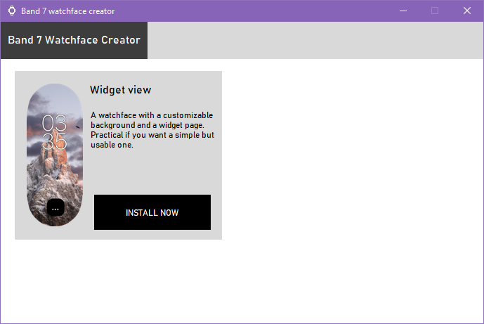

# WatchFace-Creator

A python program to create custom watchfaces for the Band 7 with ease. Just clone (or download with the green "Code <>" button) the repository on your local 
machine and execute main.py.
There is currently only one watchface, but will make more soon, along with apps

*Executable version soon !*

## How it works 

I use tkinter library to make the GUI, and [zmake](https://github.com/melianmiko/zmake) program, made by melianmiko to generate the watchface.

## Screenshots

